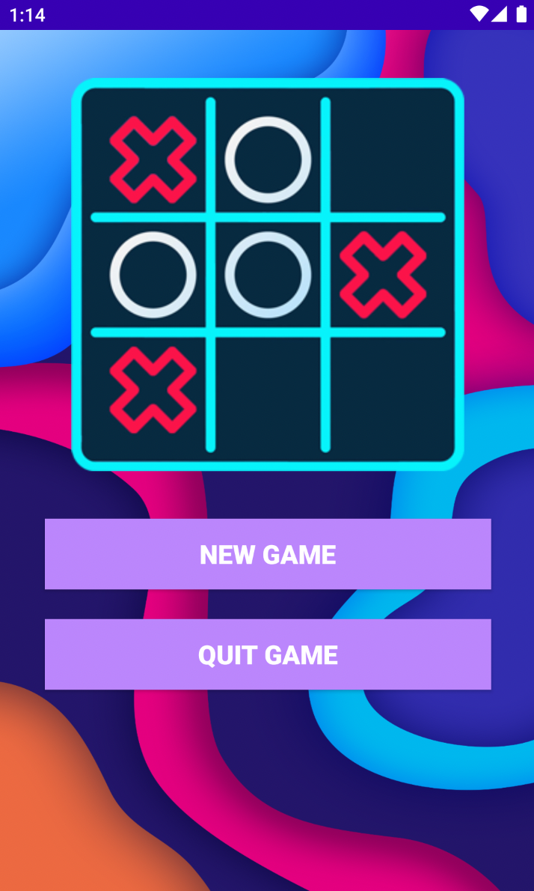
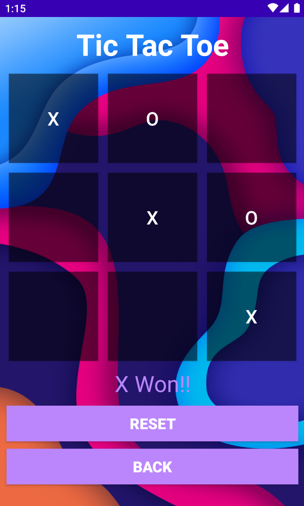
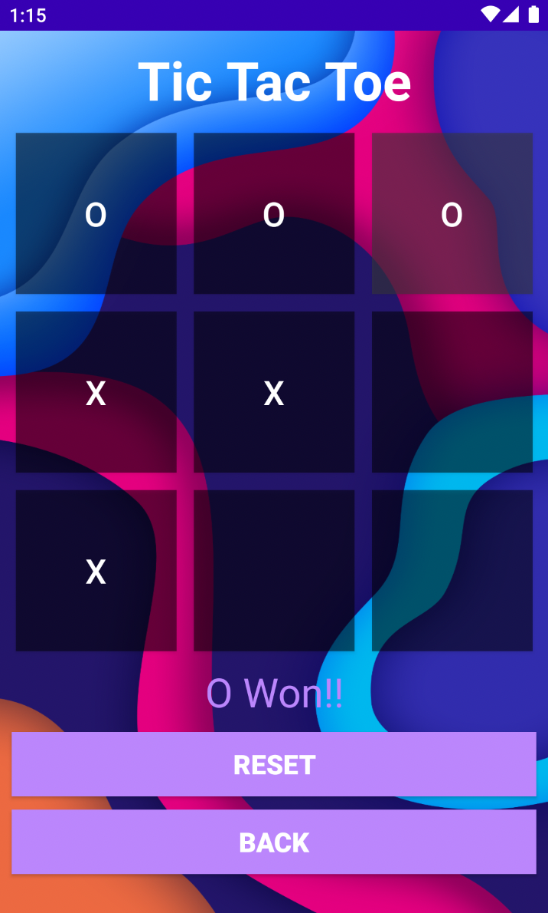
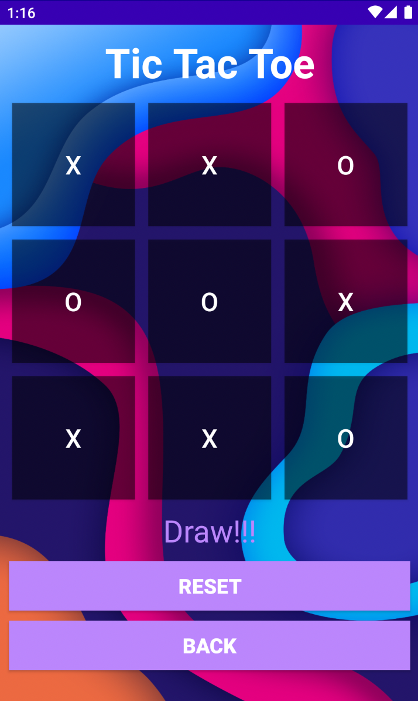

# Tic-Tac-Toe
- Tic Tac Toe is a simple android application built using java, XML and Android Studio. It constructs a digitalized version of the primitive Tic Tac Toe (XO) game, which is a two-player game with the two players making moves alternatively. The application makes use of multiple features provided by Android Studio such as backgrounds, buttons, text views and various other GUI components.

- The first players start by entering ‘X’ in anyone of the nine grids, and then the second players follows by entering an ‘O’ in one of the remaining tiles. Thus, the players play alternatively till and end state is reached, in which a player fills one full row, column, or diagonal with his allotted symbol and when no players wins and yet none of the tile are free to continue the game.

- The application makes use of an efficient JAVA code to implement the backend of the game. The frontend of the application is constructed with the help of XML. Various options are provided to the user such as to reset the game and start from the game from the start, options to  return back to the home page and to quit the game, each of which is implemented with the help of click listeners on buttons. The application also makes use of two XML pages: home page and the game page.

## Screenshots of the Application :
<table>
  <tr>
    <td>  </td>
    <td>  </td>
  </tr>
  <tr>
    <td>  </td>
    <td>  </td>
  </tr>
</table>
